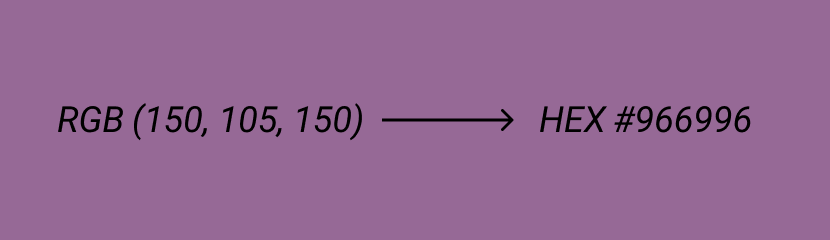

<h1 align="center">RGB to HEX Converter</h1>

<h2 align="center">Описание</h2>

Простой конвертер позволяющий быстро перевести цветовой код RGB в HEX.

<h2 align="center">Как использовать</h2>

В поле ввода вводим код RGB который необходимо конвертировать, затем кликаем по любому месту на экране и
сразу видим результат - сам цвет, в блоке под инпутом, и под цветным блоком код цвета в HEX.

<h2 align="center">Технологии</h2>

В этом проекте использовались:
* HTML
* JavaScript
* Bootstrap

<h2 align="center">Дополнительно</h2>

Проект создавался в качестве небольшой и легкой практики.

***

Посмотреть и попробовать можно [здесь](https://natalielinen.github.io/rgb-to-hex-converter/)
